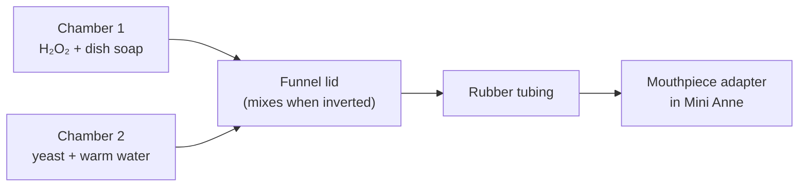

# Foaming Drowning Mannequin

A compact, instructor-built training aid that makes foam pour from a CPR manikin’s mouth during a drowning or water-rescue scenario.

It is meant for **lifeguard, EMS, and water-rescue instructors** who want a visual cue of foam at the airway without buying a specialty drowning dummy. The manikin is inflatable, so the whole kit packs small and travels easily.

> **Training use only.** This is a classroom / scenario prop. It is not a medical device and does not represent real drowning physiology. Hydrogen peroxide, soap, and yeast must stay out of eyes, mouths, and natural waterways.

---

## How it works

Two solutions stay separated until you decide the “victim” should foam:

| Chamber | Mix | Role |
| --- | --- | --- |
| **1** | Hydrogen peroxide + dish soap | Peroxide supplies oxygen; soap traps it as foam |
| **2** | Warm water + dry yeast | Yeast (catalase) triggers the reaction |

Those two mixes live in a **3D-printed mixing bottle** with a divider down the middle. Keep the bottle upright to prime and wait. When the rescue is underway, flip it. Both sides dump into a **funnel-shaped lid**, mix, and foam out through rubber tubing into a **mouthpiece adapter** that snaps into the Mini Anne mouth — the same place the lung bag normally clicks in from behind.

You can leave the tubing **disconnected from the mixing bottle** while the team pulls the manikin out of a pond or lake, then click the hose on when you want foam in the middle of the scenario.



The chemistry is the same classroom reaction as “elephant toothpaste”: yeast breaks hydrogen peroxide into water and oxygen, and the soap turns that oxygen into foam.

---

## Parts list

### Buy

| Item | Why | Link |
| --- | --- | --- |
| **Laerdal Mini Anne** (Global Set) | Inflatable adult CPR manikin. Packs down small. The stock lung bag clicks in from behind the mouth; that mount is what the printed adapter replaces. | [Amazon](https://www.amazon.com/dp/B0CHSG9MXJ) |
| **Natural latex tubing** — 3/8 in (10 mm) ID × 9/16 in (14 mm) OD, 1 m | Hose from mixing bottle to mouthpiece. Cut to length. | [Amazon](https://www.amazon.com/dp/B093WBLZMP) |
| **32 oz / 1000 ml HDPE bottles**, pack of 2 | Premix **four rounds** of each solution and mark fill lines on the side. | [Amazon](https://www.amazon.com/dp/B0DT6NVHJP) |

### 3D print

Print files go in [`3d-print-files/`](3d-print-files/). Drop the STLs there when you have them.

| Part | What it does |
| --- | --- |
| **Mouthpiece adapter** | Snaps into the Mini Anne mouth from behind, where the lungs normally click in. The tubing pushes onto the other end. |
| **Mixing bottle** | Two chambers with a center divider. Holds peroxide/soap on one side and yeast/water on the other. |
| **Funnel lid** | Caps the bottle. When you invert it, both mixes meet here and foam toward the hose barb. |

**Print settings:** PLA, **0.4 mm nozzle**. See [`3d-print-files/README.md`](3d-print-files/README.md) for suggested slicer settings.

### Consumables (grocery / pharmacy)

- 3% or 6% **hydrogen peroxide** (do not use hair-bleach or 12%+ “food grade” peroxide)
- Liquid **dish soap** (the bottle cap is about 1 tablespoon)
- Active dry **yeast** (the kind sold for baking)
- Warm water at **105–110°F / 40–43°C**

Optional: a few drops of red or pink food coloring in Chamber 1 if you want foam that reads more like pink frothy sputum.

---

## Why this manikin

Mini Anne is a good fit for a traveling foam kit:

- **Inflatable** — deflates and packs into a small bag
- **Light** — easy to toss into a lake, pool deck, or boat
- **Familiar airway** — students already know the head/chin landmarks
- **Lung mount** — the printed mouthpiece uses the same click-in from behind that the disposable lungs use, so you are not gluing anything to the face

Take the stock lung bag out before you install the adapter. You do not want peroxide foam inside the original lungs.

---

## 3D printing

1. Open the STLs in [`3d-print-files/`](3d-print-files/).
2. Slice in PLA with a **0.4 mm nozzle**.
3. Print the mixing bottle so the divider stands up (chambers open at the top).
4. Print the funnel lid with the cone pointing up or as the model author orients it; add supports if the slicer asks.
5. Check that the hose is a snug friction fit on both barbs. Latex stretches; warm the tube end in tap water if it is tight.

Suggested starting point if the models do not include a settings card:

| Setting | Suggestion |
| --- | --- |
| Material | PLA |
| Nozzle | 0.4 mm |
| Layer height | 0.20 mm |
| Infill | 20–30% (bottle), 40%+ (mouthpiece / barbs) |
| Walls | 3 perimeters |
| Supports | As needed on the funnel lid and any overhanging barbs |

---

## Assemble the kit

### 1. Convert the manikin

1. Inflate Mini Anne as usual. Do not overinflate.
2. Open the head/back access the same way you would to change lungs.
3. Remove the disposable lung bag.
4. Snap the **mouthpiece adapter** into the mouth from behind until it seats the way the lungs did.
5. Push one end of the latex tubing onto the adapter barb.

Leave the other end of the tubing free if this round starts in the water. You will attach it to the mixing bottle later.

### 2. Mark the premix bottles

The two 32 oz bottles hold **four scenario rounds**. Use a permanent marker on the side so you are not measuring from scratch every class.

**Bottle A — Chamber 1 stock (peroxide + soap)**

- Draw a fill line at **4 cups / 948 ml** for peroxide.
- Label: `+ 4 Tbsp dish soap` (or `+ 4 caps`).

That mix almost fills the 1000 ml bottle. The soap goes in *after* the peroxide line.

**Bottle B — Chamber 2 stock (yeast + water)**

- Draw a fill line at **2 cups / 472 ml** for water.
- Label: `+ 8 Tbsp yeast` (or `+ 8 caps`, about **80 g**).

Each of these bottle **caps is about one tablespoon**, so you can dose soap and yeast by capfuls if you do not have a measuring spoon on the pool deck.

Premix **Bottle A** ahead of time; peroxide + soap stores fine in a closed bottle. Mix **Bottle B** closer to class — warm water and yeast go stale if they sit.

### 3. Charge the mixing bottle

Keep the printed mixer **upright** so the divider does its job.

For **one round**, pour about **one quarter** of each stock bottle into its chamber:

| Mixer chamber | From | About |
| --- | --- | --- |
| Chamber 1 | Bottle A | 1 cup peroxide mix (~250 ml) |
| Chamber 2 | Bottle B | ½ cup yeast mix (~150 ml) |

Screw on the funnel lid. Confirm the divider is still keeping the two sides apart. The bottle is now **primed**. Set it upright next to the scenario until you want foam.

If you are mixing a single round from scratch (no stock bottles), use the per-round amounts in the recipe below.

---

## Foam recipe

### Four rounds (fill the two 32 oz bottles)

#### Chamber 1 — hydrogen peroxide + dish soap

| Ingredient | Amount |
| --- | --- |
| Hydrogen peroxide (3% or 6%) | **4 cups** = 948 ml |
| Liquid dish soap | **4 tablespoons** = 60 ml = **4 bottle caps** |

#### Chamber 2 — yeast + water

| Ingredient | Amount |
| --- | --- |
| Warm water (105–110°F / 40–43°C) | **2 cups** = 472 ml |
| Dry yeast | **8 tablespoons** = 120 ml ≈ **80 g** = **8 bottle caps** |

### One round (pour into the printed mixer)

| Chamber | Ingredient | Amount |
| --- | --- | --- |
| 1 | Hydrogen peroxide (3% or 6%) | 1 cup = 237 ml |
| 1 | Liquid dish soap | 1 tablespoon = 15 ml = 1 cap |
| 2 | Warm water (105–110°F / 40–43°C) | ½ cup = 118 ml |
| 2 | Dry yeast | 2 tablespoons ≈ 20 g = 2 caps |

**3% vs 6%:** 3% is plenty for a pool deck and is easier to clean. 6% makes a bigger, faster foam column. Do not go stronger than 6%.

**Water temperature:** 105–110°F is the sweet spot. Cooler water is sluggish. Hotter water can kill the yeast and you will get little or no foam.

---

## Running the scenario

### Deck / classroom

1. Manikin is in position with tubing already on the mixer, or with the mixer standing by.
2. Students start the rescue.
3. When you want foam, **invert the mixing bottle** and set it down on the funnel lid (or hold it inverted). Both chambers drain, mix in the lid, and foam out the mouth.
4. Let it run. You can pinch the tubing if you need to pause.

### Pond, lake, or pool rescue

The mixer does not have to go in the water.

1. Manikin is in the water with the **mouthpiece and tubing installed**, but the tubing is **off the mixing bottle**.
2. Team does the in-water rescue and gets the manikin to the deck or shore.
3. When you are ready for the “foaming patient” beat, push the free end of the tubing onto the mixer barb and invert.

That way you can stage foam in the middle of the scenario without carrying a charged bottle into the lake, and without dumping soap and peroxide into natural water.

### After it foams

Foam will keep coming until the peroxide is used up. Have towels ready. Keep foam away from the Mini Anne inflation valve and any electronics (AED trainers, phones, radios).

---

## Cleanup

1. Disconnect the tubing from the mixer **before** you turn the bottle upright again, or leftover mix will run out the barb.
2. Empty leftovers into a sink or a bucket — **not** into a lake, pond, or storm drain.
3. Rinse the mixer chambers, funnel lid, tubing, and mouthpiece with warm water until the soap is gone.
4. Pull the adapter out of the manikin, rinse the mouth area, and dry Mini Anne before you deflate it.
5. Flush the tubing; hang it so it can drain.
6. Recap the stock bottles. Bottle A can go back on the shelf. Dump Bottle B if the yeast mix has been sitting.

PLA is not dishwasher-safe on a hot cycle. Hand-wash the prints.

---

## Safety

- **Eyes and skin:** peroxide and soap sting. Have water nearby to rinse. 6% is more irritating than 3%.
- **Do not ingest** any of the mixes. This is not a food activity.
- **Do not use concentrated peroxide** (12%, 35%, or “food grade” high-test). That is a different, more dangerous reaction.
- **Not for open water dumping.** Soap, yeast, and peroxide do not belong in a pond or lake. Use the disconnect-hose workflow so mixing happens on shore.
- **Allergies:** the hose is **natural latex**. Use a silicone substitute if anyone on the team has a latex allergy.
- **Students:** tell them the foam is a prop. Do not let anyone try to suction or swallow it as if it were a real airway.
- **Storage:** keep peroxide in its original bottle until you mix Bottle A. Keep yeast dry until you mix Bottle B.

---

## Troubleshooting

| What you see | Likely cause | Fix |
| --- | --- | --- |
| Little or no foam | Water too cold, yeast old, or chambers never mixed | Use 105–110°F water, fresh yeast, and fully invert the bottle |
| Foam starts in the mixer before you flip it | Divider leak or bottle was tilted | Keep it upright; check the print for gaps in the wall |
| Foam only in the bottle, not the mouth | Kinked hose, adapter not seated, or barb clogged | Straighten the tube, reseat the mouthpiece, flush the barb |
| Slow dribble instead of a surge | 3% peroxide on a cold day, or yeast under-dosed | Warm the water, use a full 2 Tbsp yeast, or try 6% |
| Manikin getting soggy inside | Adapter not sealed / lung bag still installed | Reseat the click-in adapter; remove the original lungs |
| Yeast bottle smells sour | Mix sat too long | Dump it and mix a fresh Chamber 2 |

---

## Repo layout

```text
.
├── README.md              ← you are here
└── 3d-print-files/        ← STLs for the mouthpiece, mixing bottle, and funnel lid
```

Photos of a finished kit are welcome in an `images/` folder if you add them later.

---

## License and intent

Build this for **education and in-service training**. Do not present it as a commercial medical simulator or as a substitute for a purpose-built drowning manikin when your agency requires one.
