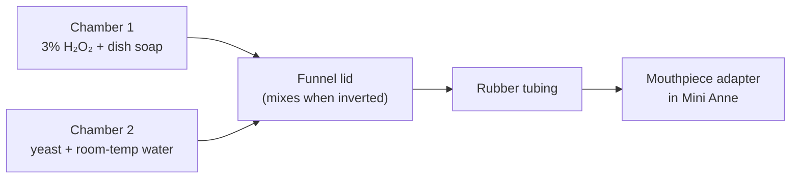
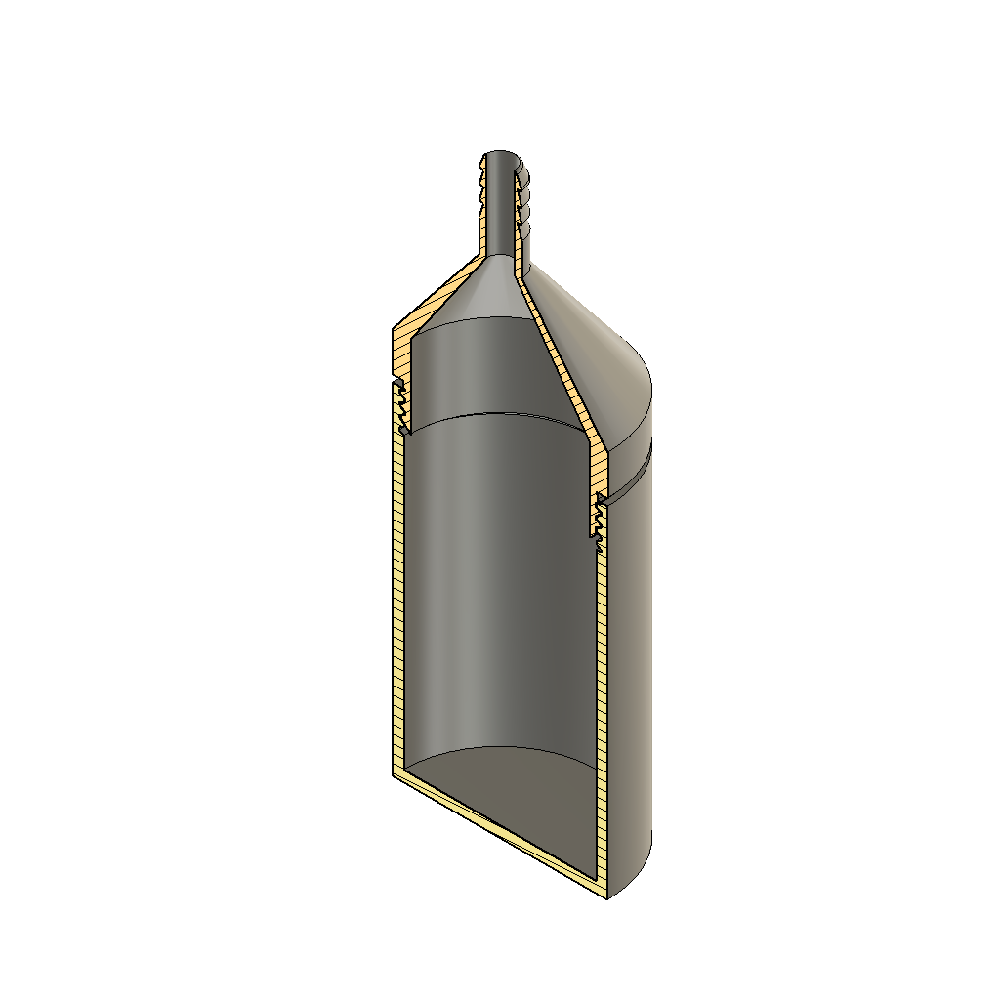
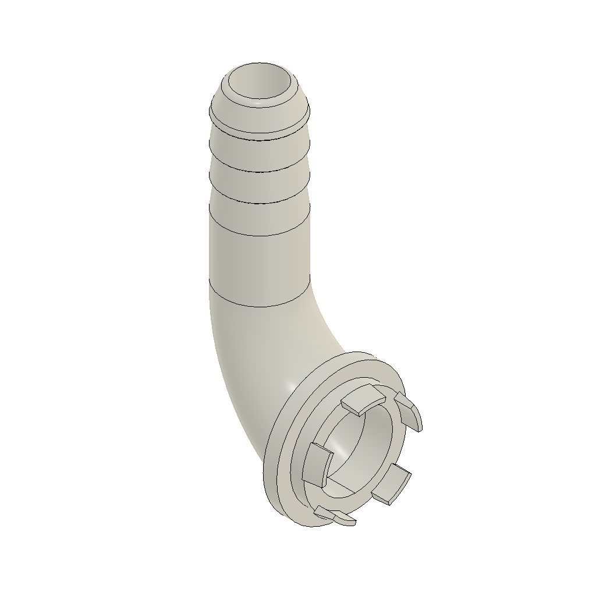

# Foaming Drowning Mannequin

A compact, instructor-built training aid that makes foam pour from a CPR manikin’s mouth during a drowning or water-rescue scenario.

It is meant for **lifeguard, EMS, and water-rescue instructors** who want a visual cue of foam at the airway without buying a specialty drowning dummy. The manikin is inflatable, so the whole kit packs small and travels easily.

> **Training use only.** This is a classroom / scenario prop, not a medical device.

---

## How it works

Two solutions stay separated until you decide the “victim” should foam:

| Chamber | Mix | Role |
| --- | --- | --- |
| **1** | 3% hydrogen peroxide + dish soap | Peroxide supplies oxygen; soap traps it as foam |
| **2** | Room-temperature water\* + dry yeast | Yeast (catalase) triggers the reaction |

Those two mixes live in a **3D-printed mixing bottle** with a divider down the middle. Keep the bottle upright to prime and wait. When the rescue is underway, flip it. Both sides dump into a **funnel-shaped lid**, mix, and foam out through rubber tubing into a **mouthpiece adapter** that pops onto the Mini Anne in place of the lung bag.

You can leave the tubing **disconnected from the mixing bottle** while the team pulls the manikin out of a pond or lake, then attach the hose when you want foam in the middle of the scenario.



The chemistry is the same classroom reaction as “elephant toothpaste”: yeast breaks hydrogen peroxide into water and oxygen, and the soap turns that oxygen into foam.

\* **Water temperature is the throttle.** Room-temperature / tepid water gives a good, realistic rate. Warmer water speeds the reaction; colder water slows it. Too hot and foam explodes out of the mouth in an unrealistic way. Too cold and it barely activates.

---

## Parts list

### Buy

| Item | Why | Link |
| --- | --- | --- |
| **Laerdal Mini Anne** (Global Set) | Inflatable adult CPR manikin. Packs down small. The lung bag pops off the mouth from behind; that is where the printed adapter goes. | [Amazon](https://www.amazon.com/dp/B0CHSG9MXJ) |
| **Natural latex tubing** — 3/8 in (10 mm) ID × 9/16 in (14 mm) OD, 1 m | Hose from mixing bottle to mouthpiece. Cut to length. | [Amazon](https://www.amazon.com/dp/B093WBLZMP) |
| **32 oz / 1000 ml HDPE bottles**, pack of 2 | Premix **four rounds** of each solution and mark fill lines on the side. | [Amazon](https://www.amazon.com/dp/B0DT6NVHJP) |

### 3D print

Print the **3MF** files in [`3d-print-files/`](3d-print-files/). The matching **Fusion 360** (`.f3d`) files are there if you want to edit the models.

<p align="center">
  
  
</p>

| Part | Print this | Edit this |
| --- | --- | --- |
| **Mixing bottle** (divided jar + funnel lid) | [Drowning Mannequin Bottle.3mf](3d-print-files/Drowning%20Mannequin%20Bottle.3mf) | [Drowning Mannequin Bottle.f3d](3d-print-files/Drowning%20Mannequin%20Bottle.f3d) |
| **Mouthpiece adapter** | [Laerdal Mini Anne Mannequin Mouth Attachment.3mf](3d-print-files/Laerdal%20Mini%20Anne%20Mannequin%20Mouth%20Attachment.3mf) | [Laerdal Mini Anne Mannequin Mouth Attachment.f3d](3d-print-files/Laerdal%20Mini%20Anne%20Mannequin%20Mouth%20Attachment.f3d) |

The bottle 3MF contains two bodies: **Jar** (divider down the middle) and **Lid** (funnel that mixes the two sides when you invert it, with a barb for the hose). The mouthpiece 3MF is a **T adapter** that pops on where the lungs were; the other end takes the rubber tubing.

**Print settings:** PLA, **0.4 mm nozzle**. More detail in [`3d-print-files/README.md`](3d-print-files/README.md).

### Consumables (grocery / pharmacy)

- **3% hydrogen peroxide**
- Liquid **dish soap** (the bottle cap is about 1 tablespoon)
- Active dry **yeast** (the kind sold for baking)
- **Room-temperature water\***

---

## Why this manikin

Mini Anne is a good fit for a traveling foam kit:

- **Inflatable** — deflates and packs into a small bag
- **Light** — easy to toss into a lake, pool deck, or boat
- **Familiar airway** — students already know the head/chin landmarks
- **Lung mount** — lift the face, pop off the lung bag, pop on the adapter. Nothing is glued to the face.

---

## 3D printing

1. Open the `.3mf` files in your slicer (Bambu Studio, PrusaSlicer, Cura, and most others open 3MF directly).
2. Slice in **PLA** with a **0.4 mm nozzle**.
3. Print the jar with the chambers open upward so the divider is vertical. Print the lid as oriented in the 3MF; add supports if the slicer asks.
4. Check that the 10 mm ID latex tubing is a snug friction fit on both barbs. Latex stretches; warm the tube end in tap water if it is tight.

Suggested starting point:

| Setting | Suggestion |
| --- | --- |
| Material | PLA |
| Nozzle | 0.4 mm |
| Layer height | 0.20 mm |
| Infill | 20–30% (bottle), 40%+ (mouthpiece / barbs) |
| Walls | 3 perimeters |
| Supports | As needed on the funnel lid and any overhanging barbs |

To change geometry, open the `.f3d` files in [Fusion 360](https://www.autodesk.com/products/fusion-360/overview).

---

## Assemble the kit

### 1. Install the mouthpiece

1. Inflate Mini Anne as usual.
2. **Lift up the face** of the mannequin.
3. **Pop off the lung bag** and detach it from the mannequin.
4. **Pop on the adapter** in that same spot.
5. Push one end of the rubber tubing onto the adapter barb.

Leave the other end of the tubing free if this round starts in the water. You will attach it to the mixing bottle later.

### 2. Mark the premix bottles

The two 32 oz bottles hold **four scenario rounds**. Use a permanent marker on the side so you are not measuring from scratch every class.

**Bottle A — Chamber 1 stock (peroxide + soap)**

- Draw a fill line at **4 cups / 948 ml** for peroxide.
- Label: `+ 4 Tbsp dish soap` (or `+ 4 caps`).

That mix almost fills the 1000 ml bottle. The soap goes in *after* the peroxide line.

**Bottle B — Chamber 2 stock (yeast + water)**

- Draw a fill line at **2 cups / 472 ml** for water.
- Label: `+ 8 Tbsp yeast` (or `+ 8 caps`, about **80 g**).

Each of these bottle **caps is about one tablespoon**, so you can dose soap and yeast by capfuls if you do not have a measuring spoon on the pool deck.

Premix **Bottle A** ahead of time; peroxide + soap stores fine in a closed bottle. Mix **Bottle B** closer to class so the yeast stays active.

### 3. Charge the mixing bottle

Keep the printed mixer **upright** so the divider does its job.

For **one round**, pour about **one quarter** of each stock bottle into its chamber:

| Mixer chamber | From | About |
| --- | --- | --- |
| Chamber 1 | Bottle A | 1 cup peroxide mix (~250 ml) |
| Chamber 2 | Bottle B | ½ cup yeast mix (~150 ml) |

Screw on the funnel lid. Confirm the divider is still keeping the two sides apart. The bottle is now **primed**. Set it upright next to the scenario until you want foam.

If you are mixing a single round from scratch (no stock bottles), use the per-round amounts in the recipe below.

---

## Foam recipe

This kit is built around **3% hydrogen peroxide** and **room-temperature water\***.

### Four rounds (fill the two 32 oz bottles)

#### Chamber 1 — hydrogen peroxide + dish soap

| Ingredient | Amount |
| --- | --- |
| 3% hydrogen peroxide | **4 cups** = 948 ml |
| Liquid dish soap | **4 tablespoons** = 60 ml = **4 bottle caps** |

#### Chamber 2 — yeast + water

| Ingredient | Amount |
| --- | --- |
| Room-temperature water\* | **2 cups** = 472 ml |
| Dry yeast | **8 tablespoons** = 120 ml ≈ **80 g** = **8 bottle caps** |

### One round (pour into the printed mixer)

| Chamber | Ingredient | Amount |
| --- | --- | --- |
| 1 | 3% hydrogen peroxide | 1 cup = 237 ml |
| 1 | Liquid dish soap | 1 tablespoon = 15 ml = 1 cap |
| 2 | Room-temperature water\* | ½ cup = 118 ml |
| 2 | Dry yeast | 2 tablespoons ≈ 20 g = 2 caps |

---

## Running the scenario

### Deck / classroom

1. Manikin is in position with tubing already on the mixer, or with the mixer standing by.
2. Students start the rescue.
3. When you want foam, **invert the mixing bottle**. Both chambers drain, mix in the lid, and foam out the mouth.

### Pond, lake, or pool rescue

The mixer does not have to go in the water.

1. Manikin is in the water with the **mouthpiece and tubing installed**, but the tubing is **off the mixing bottle**.
2. Team does the in-water rescue and gets the manikin to the deck or shore.
3. When you are ready for foam, push the free end of the tubing onto the mixer barb and invert.

---

## Cleanup

Rinse everything with water.

Between multiple runs, **rinse out the mixing bottle with clean water** so leftover reactants do not sit in a chamber and prematurely react on the next fill.

---

## Troubleshooting

| What you see | Likely cause | Fix |
| --- | --- | --- |
| Little or no foam | Water too cold, yeast old, or chambers never mixed | Use tepid water, fresh yeast, and fully invert the bottle |
| Foam explodes out of the mouth | Water too hot | Let the water cool to room temperature |
| Foam starts in the mixer before you flip it | Divider leak, bottle was tilted, or leftover mix from the last run | Keep it upright; rinse the bottle between runs |
| Foam only in the bottle, not the mouth | Kinked hose or adapter not seated | Straighten the tube and reseat the mouthpiece |

---

## Repo layout

```text
.
├── README.md
├── images/                ← photos and CAD previews for this page
└── 3d-print-files/        ← 3MF (print) and f3d (Fusion) models
```
